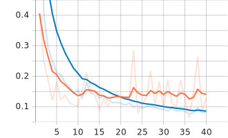

# PointNet for classification

A very simple implementation of `PointNet` for point cloud classification. It is based on the repository [**Open3D-PointNet**](https://github.com/isl-org/Open3D-PointNet) by _open3d_ and the course [**LEARN DEEP POINT CLOUDS: Introduction to 3D Deep Learning**](https://courses.thinkautonomous.ai/deep-point-clouds) by _thinkautonomous_. 

## Setup
```
# Install open3d
pip install open3d==0.12.0

# Install pytorch 1.7.0 
# Can be cpu or cuda
```

## Dataset
It's the [**ShapeNetCore**](https://shapenet.org/). It contains 3D models (point cloud), along with their corresponding class category (classification) and point annotation (part segmenation). 

To download the dataset, execute:
```bash
$> sh download_dataset.sh
```

The structure of the dataset is as follows :
```
├── 02691156
│   ├── points
│   ├── points_label
│   └── seg_img
├── 02773838
│   ├── points
│   ├── points_label
│   └── seg_img
├── ...
```

## Scripts
* **Training**: For a (straightforward) training with default parameters, just launch `python train_classification.py <PATH_TO_SHAPENETCORE>`. Execute `python train_classification.py --help` to list all arguments.

* **Predict and visualize**: Again, execute `python predict.py --help` to list all arguments. You will visualize : 
    * A bar plot representing the probability of each class :
    

    * The colored point cloud :
    
    
## Experiments

I trained a `pointnet` model using the configuration bellow :
```bash
# optimizer = optim.SGD(classifier.parameters(), lr=0.01, momentum=0.9)
python train_classification.py \
    --batch_size=8
    --num_workers=2
    --epochs=40
```

**Learning curves**

<span style="color:blue">Blue</span> is `train`, <span style="color:red">Red</span> is `test`.

* **Accuracy :**


The model achieves an accuracy of `98%`, and overfit after `22 epochs`.

* **Loss :**
